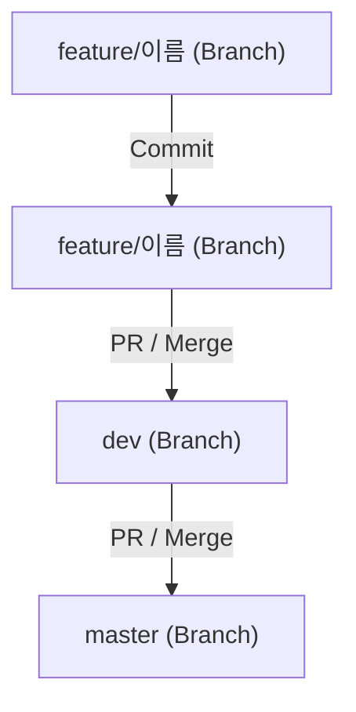

# 망호 웹사이트

## 목차
- [소개](#소개)
- [사용 기술](#사용-기술)
- [프로젝트 개발 환경 설정](#프로젝트-개발-환경-설정)
- [Branch Merge Flow](#branch-merge-flow)
- [프로젝트 실행](#프로젝트-실행)
- [커밋 규칙](#커밋-규칙)


## 소개
[예시 폴더 구조](https://github.com/mertthesamael/lalasia)


## 사용 기술
- Next.js 15.1.6
- TypeScript ^5
- React ^19
- React DOM ^19
- Node.js ^20
- Tailwind CSS ^3.4.1
- ESLint ^9
- PostCSS ^8


# 프로젝트 개발 환경 설정
```bash
# 프로젝트 클론
git clone https://github.com/MaBongPal/mangho-website
cd mangho-website

# 최신 dev 브랜치 가져오기
git checkout dev
git pull origin dev

# feature 브랜치 생성 후 이동
git checkout -b feature/이름

# 코드 수정 후 커밋
git add .
git commit -m "커밋 메시지"

# 원격 저장소로 업로드
git push origin feature/이름

# GitHub에서 PR(Pull Request) 생성 및 코드 리뷰

# 병합 완료 후 브랜치 정리
git checkout dev
git pull origin dev
```


# Branch Merge Flow



## 프로젝트 실행
```bash
npm install # 최초 1회 실행
npm run dev # 개발 모드 실행
```
http://localhost:3000 # 실행 확인


## 커밋 규칙
```bash
Component 추가

- Primary Button 추가.
- Secondary Button 추가.
```